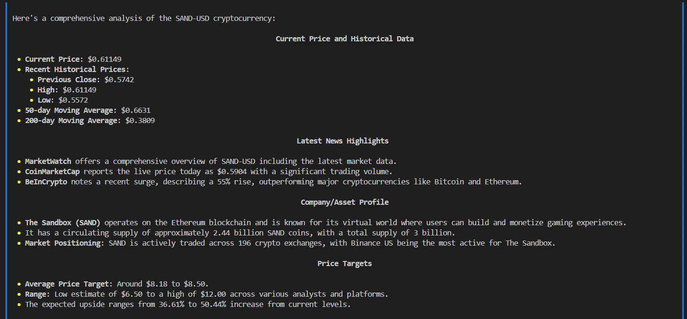

# MarketScope AI 🚀

[](https://www.linkedin.com/in/pejman-ebrahimi-4a60151a7/)
[](https://huggingface.co/arad1367)
[](https://arad1367.github.io/pejman-ebrahimi/)
[](https://www.giltech-megoldasok.com/)

A comprehensive market intelligence system that combines web searching, financial analysis, and team coordination capabilities using the [Phi framework](https://www.phidata.com/).

## Table of Contents
- [Features](#features)
- [System Architecture](#system-architecture)
- [Prerequisites](#prerequisites)
- [Installation](#installation)
- [Usage](#usage)
  - [Terminal Interface](#terminal-interface)
  - [Phi Playground Interface](#phi-playground-interface)
- [Example Outputs](#example-outputs)
- [Development](#development)
- [Contact](#contact)
- [License](#license)

## Features

- **Multi-Agent System**:
  - Web Search Agent: Real-time market information and news via DuckDuckGo
  - Finance AI Agent: Technical and fundamental analysis using OpenBB tools
  - Market Analysis Team: Coordinated insights from multiple agents

- **Comprehensive Analysis**:
  - Real-time price data
  - Latest market news
  - Company/Asset profiles
  - Price targets
  - Market trends and impacts

- **Asset Support**:
  - Stocks (e.g., TSLA, NFLX)
  - Cryptocurrencies (e.g., ETH-USD, SAND-USD)
  - Auto-detection of asset types

- **User Interfaces**:
  - Terminal-based interface
  - Web-based Phi Playground interface

## System Architecture

The system consists of three main components:

1. **Web Search Agent**:
   - Fetches market information and news
   - Prioritizes recent and reliable sources
   - Provides market context
   - Adapts search terms by asset type

2. **Finance AI Agent**:
   - Real-time price data
   - Technical analysis
   - Fundamental analysis
   - Price target tracking
   - Uses OpenBB tools

3. **Market Analysis Team**:
   - Combines insights from both agents
   - Provides actionable recommendations
   - Cross-references multiple data sources
   - Offers both short and long-term perspectives

## Prerequisites

- Python 3.8+
- API Keys:
  - GROQ API key
  - PHI API key
  - OpenAI API key (optional)

## Installation

1. Clone the repository:
```bash
git clone https://github.com/arad1367/market-scope-ai.git
cd market-scope-ai
```

2. Create and activate a virtual environment (recommended):
```bash
python -m venv venv
source venv/bin/activate  # On Windows: venv\Scripts\activate
```

3. Install dependencies:
```bash
pip install -r requirements.txt
# For additional features:
# pip install -r alternative_requirements.txt
```

4. Create a `.env` file with your API keys:
```env
GROQ_API_KEY=your_groq_api_key
PHI_API_KEY=your_phi_api_key
OPENAI_API_KEY=your_openai_api_key
```

## Usage

### Terminal Interface

Run the application in terminal mode:
```bash
python agents.py
```

You'll see the following options:
1. Analyze specific asset (stock/crypto)
2. Market overview
3. Custom query
4. Exit

### Phi Playground Interface

Run the application with the Phi Playground interface:
```bash
python agents.py
```

The playground provides a web interface for direct interaction with the agents.

## Example Outputs

Here are some sample analyses from the system:

### Cryptocurrency Analysis

#### Ethereum (ETH-USD)


#### The Sandbox (SAND-USD)



### Stock Analysis

#### Tesla (TSLA)


#### Netflix (NFLX)


## Development

Contributions are welcome! Please feel free to submit a Pull Request.

## Contact

- **Developer**: Pejman Ebrahimi
- **Email**: 
  - pejman.ebrahimi@uni.li
  - pejman.ebrahimi77@gmail.com
- **LinkedIn**: [Pejman Ebrahimi](https://www.linkedin.com/in/pejman-ebrahimi-4a60151a7/)
- **Website**: [Portfolio](https://arad1367.github.io/pejman-ebrahimi/)
- **Company**: [GilTech](https://www.giltech-megoldasok.com/)

## License

This project is licensed under the MIT License - see the [LICENSE](LICENSE) file for details.

---
Built with ❤️ using [Phi Framework](https://www.phidata.com/)